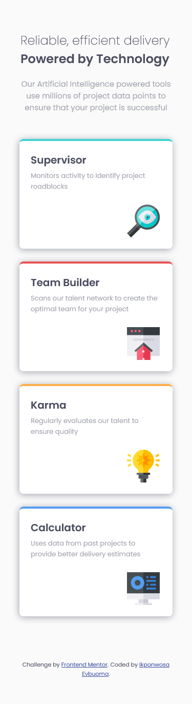
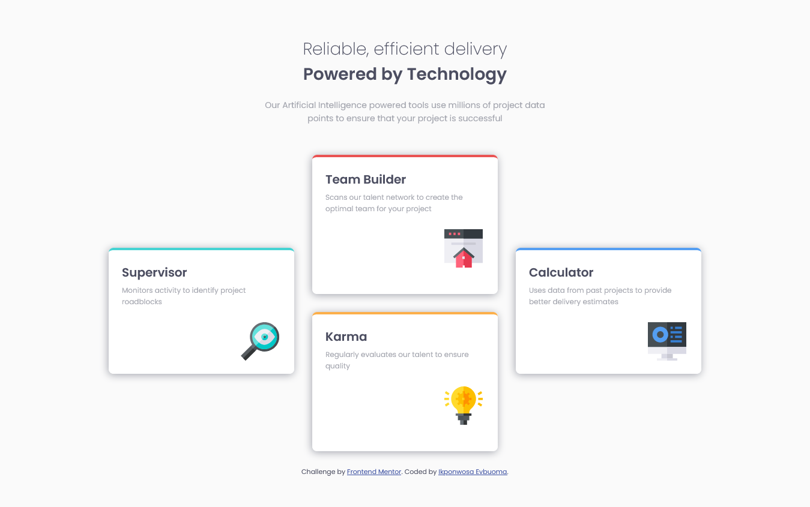

# Frontend Mentor - Four card feature section solution

This is a solution to the [Four card feature section challenge on Frontend Mentor](https://www.frontendmentor.io/challenges/four-card-feature-section-weK1eFYK). Frontend Mentor challenges help you improve your coding skills by building realistic projects.

## Table of contents

- [Overview](#overview)
  - [The challenge](#the-challenge)
  - [Screenshot](#screenshot)
  - [Links](#links)
- [My process](#my-process)
  - [Built with](#built-with)
  - [What I learned](#what-i-learned)
  - [Useful resources](#useful-resources)
- [Author](#author)


## Overview

### The challenge

Users should be able to:

- View the optimal layout for the site depending on their device's screen size

### Screenshot

- Mobile Version




- Desktop Version




### Links

- Solution URL: [Add solution URL here](https://your-solution-url.com)
- Live Site URL: [Add live site URL here](https://your-live-site-url.com)

## My process

### Built with

- Semantic HTML5 markup
- CSS custom properties
- Flexbox
- CSS Grid
- Mobile-first workflow


### What I learned

- How to use grid column gap and grid row gap.
- How to use grid row.
- How to use box-shadow.

```css
  .container{
    grid-row: 2/3;
    grid-column-gap: 30px;
    grid-row-gap: 5px;
  }

  .cards{
    box-shadow: -1px 2px 13px var(--greyish-blue);
  }
```


### Useful resources

- [Box-shadow](https://www.example.com) - This really explains how to use the box-shadow property with a lot of editable examples.


## Author

- Frontend Mentor - [@ikponwosae](https://www.frontendmentor.io/profile/ikponwosae)
- Twitter - [@neneecodes](https://www.twitter.com/neneecodes)
- Medium - [@ikponwosae](https://medium.com/@ikponwosae)
